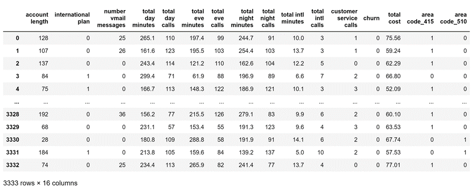
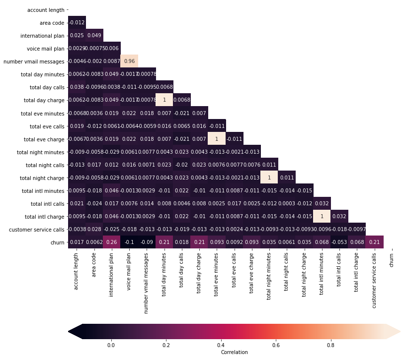
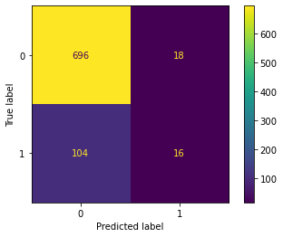
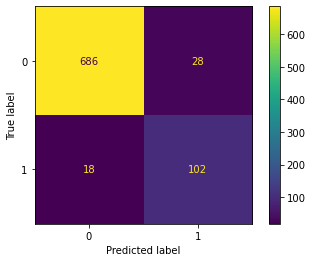
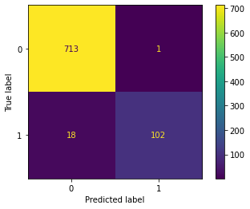

# Telecom-Churn-Model

**Author:** Grant Edwards

## Overview

SyriaTel is experiencing a high level of customers churning and would like to find a way to help identify customers that will potentially leave before they do. To help solve this issue, we will use machine learning models to help predict customers that will churn. Being able to identify customers thar will likely churn will be extremely useful in helping with customer retention and give the company an opportunity to reach out and work with customers to help keep them as customers.

To accomplish this goal we will use historical data from the organization that contains various metrics that we will use to predict whether a customer will churn or not. Some of the data that is included in that dataset, including the length of time the customer had the account, whether the customer has a voicemail plan, the total time and charges for the calls and whether or not the customer has had customer service calls, among other things.
***

## Business Problem

Customer churning is always a major problem for business, as it represents a loss in customers and revenue and poses a major challenge for a business to grow. Reducing customer churn is an important part of running a business and being able to recognize what is causing customers to leave is a great recognition of a businesses weaknesses. Being able to predict when a customer will churn before they do also will give SyriaTel an opportunity to make an effort to try and retain the customers business through offers and improved customer service. 

From the dataset we will be using to build the predict model customer churn is at 14%, and accounts for 16% of total revenue ($31,567 loss of $198,146 gross revenue). The mean loss per customer is $65.36. Knowing the total loss and the loss per customer gives us an understanding as well for how much the company should spend to try and retain customers, as it would not make sense to spend more than the loss to try and retain customers.
***

## Data



Looking at the dataset, we have the rows of different accounts containing the variable churn, which we will be our target variable. The other columns will be our independent variables. Account length is the number of months that the account has been active. Area code is a code, splitting the country into 3 regions. Voice mail plan is whether the customer has a voicemail plan and number of vmail messages is how many voicemail messages the customer received. Total day/eve/night/intl minute/calls/charges are how many minutes calls and the charge in dollars respectively for the different times of the day or if it was an international call. Customer service calls is how many times the customer called customer service. 

There is also state and phone number which we will drop as these should both be arbitrary.



Because of perfect correlation between the minutes for phone calls and the cost for each erspective category, we will create a total cost column and remove the individual charge columns. This is not the total cost for the customers bills, as it does not include things such as voicemail plan, but is the total cost for the calls made. 
***

## Methods

We started by prepaering the data, making sure everything is either a float or integer, and that categorical data (like area code) are seperated into dummy columns. We then isolated our dependant (or target) variable, churn, and created train and testing dataset split to build and test our models and normalized our independent variables. We used confusion matrix, a mean cross validation (5 variable models), and returned the precision, recall, accuracy and F1-score for our models to see how they performed. 

For our first model we tried building with simple linear regression. 

We then tried build a decission tree and optimizing the tree. 

We then used a K-Nearest Neighbor model, pipeline methods and ensemble methods such as bagging, random forests, grid searches, gradient boost, adaboost, and xgboost. 


***

## Results

For the most significant variables we found that the total cost was the strongest feature in predicting if a customer would churn, followed by number of voicemails, anything retaining to international calling, and customer service calls.


***

For the linear regression model that we started with, we observed the following:

Precision Score: 0.4706

Recall Score: 0.1333

Accuracy Score: 0.8537

F1-Score: 0.2078

Mean Cross Validation: 0.6547


***

For the decission tree model, we observed the following:

Precision Score: 0.7846

Recall Score: 0.8500

Accuracy Score: 0.9448

F1-Score: 0.8160

Mean Cross Validation: 0.9616


***

For the optimized decission tree model, we observed the following by setting the max depth to 6 and the minimum samples per split to 12:

Precision Score: 0.9902

Recall Score: 0.8417

Accuracy Score: 0.9760

F1-Score: 0.9099

Mean Cross Validation: 0.9724


***

For the Ranodm Forest model, we observed the following by setting the max depth to 5, the max features to 10 and the number of estimators to 20:

Precision Score: 0.9904

Recall Score: 0.8583

Accuracy Score: 0.9784

F1-Score: 0.9196

Mean Cross Validation: 0.9700


***

The best performing model that we found, with confirmation from the cross validation, was a gradient boost model:

Precision Score: 0.9811

Recall Score: 0.8667

Accuracy Score: 0.9784

F1-Score: 0.9204

Mean Cross Validation: 0.9772


***

We also tried an XGBoost model, although it was slighlty behind the gradient boost model:

Precision Score: 0.9904

Recall Score: 0.8538

Accuracy Score: 0.9784

F1-Score: 0.9196

Mean Cross Validation: 0.9736


***

## Conclusions

The best performing model that we found, with confirmation from the cross validation, was a gradient boost model. It had a mean cross validation score of 97.72%, a recall score of 86.67%, a precision score of 98.11%, accuracy at 97.84%, and a F1-score of 92.04%.
 
The model had a couple of false positives, but mostly there were 16 false negatives. These false negatives were customers that churned, however the model could not predict them doing so. This was the lowest we were able to get any model while sticking with a random seed of 11 and is likely due to factors outside of our dataset that caused the customer to churn. People can be tricky to get a prediction on and what will make them want to drop a company’s services. Being able to accurately predict churning customers 86.7% is a great model and we can be confident that most, if not all, customers that are predicted to churn, will churn. This can make a useful tool for the company to help keep customer retention higher, by trying to work with the predicted churning customers to find what we can do to keep their business.
 
Unfortunately we did miss some churning customers, even when we focused the model to try and recall as many churning customers as possible. This can be due to many factors and as stated above people can be tricky to predict. There are many factors that can affect people and factors outside of the dataset that could cause the decision to influence people to drop our services. To understand what caused them to leave, we could reach out and see what the cause of their departures were.
 
To improve the model further, there could be opportunities to run more grid searches over different parameters, and work with more complex ensembles. This overall is a strong model that should help in identifying almost all churning customers and give the company an opportunity to reach out through a customer retention program to help prevent the customer from churning. 
***

## For More Information

Please review our full analysis in [our Jupyter Notebook](./tele-model.ipynb) or our [presentation](./tele-model-presentation.pdf).

For any additional questions, please contact **Grant Edwards, grantedwards11@gmail.com**

## Repository Structure

Describe the structure of your repository and its contents, for example:

```
├── README.md                           <- The top-level README for reviewers of this project
├── tele-model.ipynb               <- Narrative documentation of analysis in Jupyter notebook
├── tele-model-presentation.pdf        <- PDF version of project presentation
├── Data                                <- Both sourced externally and generated from code
└── images                              <- Generated from code
```
